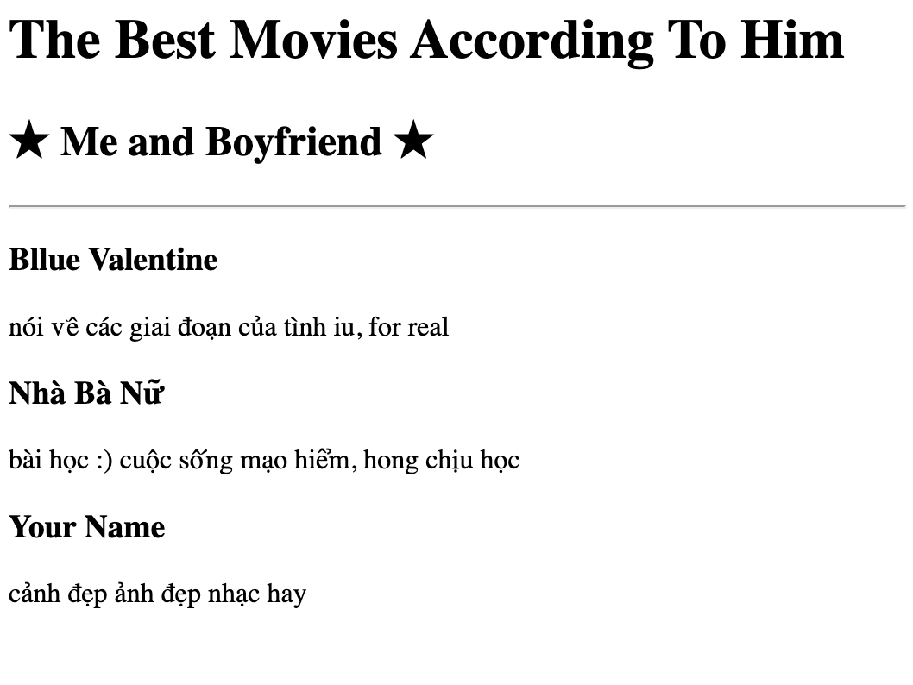

# html-portfolio
<h1>About Me</h1>

I dont have much to say, and i dont know how to start... i will finish later.

I love my taste of music, i love Taylor Swift at a pretty young age, i think she create a beautiful part in my soul. 
  I wanna work when i am ready, so spare time is important to get well-qualitied results! 

✮༉‧₊˚🕯️🖤❀༉‧₊˚.✮

<!-- Example image URL -->
<h1>Birthday Party</h1>
<h2>on the December 13th</h2>

<h3>what to bring</h3>
<ul>
    <li>baloons</li>
    <li>cake</li>
    <li>sweets</li>
    <li>flowers</li>
    <li>present lol</li>
</ul>
<h3>This is where you should head to:</h3>
<a 
href="https://www.google.com/maps/@35.7040744,139.5577317,3a,75y,289.6h,87.01t,0.72r/data=!3m6!1e1!3m4!1sgT28ssf0BB2LxZ63JNcL1w!2e0!7i13312!8i6656">Google Map link
</a>
<h1>Contact Me</h1>

Tel: +8915389628

Email: tuyetnhunqqq@gmail.com

Status: In a relationship

<!-- Write your code below -->
<h1>The Best Movies According To Him </h1>
<h2>★ Me and Boyfriend ★</h2>

<h3>Bllue Valentine</h3>

nói về các giai đoạn của tình iu, for real

<h3>Nhà Bà Nữ</h3>

bài học :) cuộc sống mạo hiểm, hong chịu học

<h3>Your Name</h3>

cảnh đẹp ảnh đẹp nhạc hay

